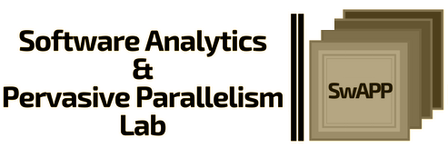

# Welcome to _SwAPP LAB_

The Laboratory for Software Analytics and Pervasive Parallelism, 
led by Ali Jannesari in the Department of Computer Science at Iowa State University, 
primarily works at the intersection of parallel computing and data science. 
Our mission is to advance the state of the art in building reliable and efficient software and utilizing analytical methods and parallel computing. 
Our results and research findings help application developers to utilize the modern heterogeneous computing platforms to develop complex software of in-demand areas such as data science and high-performance computing (HPC). 
Visit our lab page for more information: [SwAPP](https://www.cs.iastate.edu/swapp).

## Contributor of this Project

* `Dr. Ali Jannesari`, Director of Software Analytics and Pervasive Parallelism (SwAPP) Lab
* `Sixing Yu`, SwAPP Researcher, PhD student at Iowa State University
<!-- * `Jahid Hasan`, Research Assistant -->